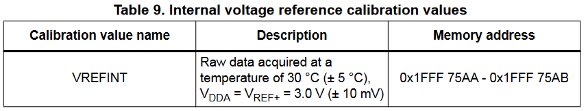
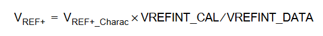
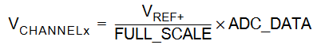

# Mbed-battery-status

Klasse die de huidige spanning van de batterij spanning gaat meten. Het geef een float terug in volts.

Om de waarde correct in te lezen maken we gebruik van de ingebouwde calibratie waarde van de microcontroller. Deze waarde staat altijd op dezelfde plek in het geheugen. Dit zie je hier onder:

Nu moeten we gewoon de formules toepassen die staan in de reference manual:

- **VREF+_Charac**: Waarde van VREF+ tijdens calibratie (altijd 3.0v zie tabel 9).
- **VREFIN_CAL**: De calibratie waarde in het geheugen.
- **VREFIN_DATA**: ADC waarde van VREF.

Als Vref+ berekent is kunnen we de spanning van de batterij berekenen:

- **FULL_SCALE**: Max waarde van de ADC (212 - 1 = 4095).
- **ADC_DATA**: ADC waarde van te meten channel (voor ons VBAT</dub>).
